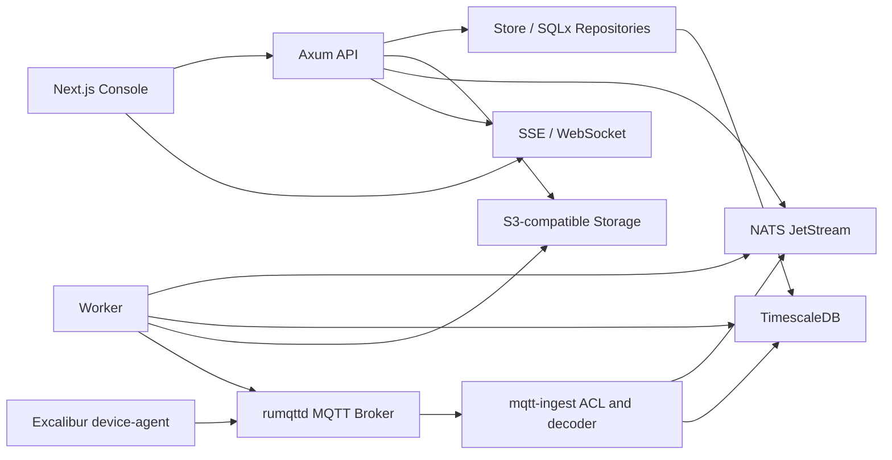

# 架构总览

Excalibur 采用清晰的控制面、数据面和设备端分层。控制面处理用户、租户、设备、证书、动作、固件、告警和 dashboard 配置；数据面处理 MQTT 接入、遥测解析、批量写入、command status；设备端 `device-agent` 负责 Linux 设备上的采集、缓存、MQTT 通信、OTA 和诊断。

## 逻辑组件

如果当前 mdBook 没有启用 Mermaid preprocessor，上面的图会以代码块展示。它仍然是架构源文档，后续可以接入 `mdbook-mermaid` 渲染。

## 控制面路径

1. 用户通过 Console 调用 `/api/v1/auth/register` 或 `/api/v1/auth/login` 获取 session token。
2. Console 调用 org/project/device/stream/action/firmware/dashboard/alert/audit API。
3. API 通过 RBAC 检查访问权限，所有项目级资源都带 `project_id`。
4. 开发模式写入 `MemoryStore`；`timescale` 模式写入 `PgStore` SQL repositories。
5. API 暴露 `/api/v1/openapi.json`，后续前端 TS client 应由 OpenAPI 生成。

## 设备数据路径

1. 设备通过 CSR 或 dev auth JSON 获得 broker、project_id、device_id、CA、device cert 和私钥路径。
2. `device-agent` 使用 mTLS 连接 MQTT broker。
3. 设备向 `v1/p/{project_id}/d/{device_id}/telemetry/{stream}` 发布 JSON array。
4. MQTT runtime 调用 `mqtt-ingest` ingest path；本地 runtime 会按 topic 查 device，生产 hook 还必须确认 topic project/device 与证书身份一致。
5. ingest 解码 payload，触发 heartbeat，批量写入 TimescaleDB hypertable，必要时写入 NATS JetStream。
6. Dashboard query 从 TimescaleDB 查询 raw rows、continuous aggregate 或 cache。

当前仓库已实现第 3 到第 5 步中的本地 rumqttd listener、topic parser、payload decoder、ACL、内存 store 写入和 SQL repository 写入；生产 mTLS broker hook、NATS buffer 和高吞吐 COPY writer 仍待生产化。

## 命令路径

1. 操作员在 Console 创建 action，例如 `ota.install`。
2. API 校验 payload，创建 action 记录，写 audit。
3. dispatcher/worker 读取 queued action，构造 command payload。
4. dispatcher 发布到 `v1/p/{project_id}/d/{device_id}/commands`。
5. `device-agent` 执行 action，向 `commands/status` 发送状态数组。
6. ingest 更新 action target 和 aggregate action 状态，并通过 SSE 推送进度。

当前仓库已实现 API action 创建、payload 校验、agent command shape 和 status ingest；dispatcher 发布与 action target 持久表联动仍待实现。

## 数据所有权

| 数据 | 生产存储 | 当前实现 |
| --- | --- | --- |
| 用户、组织、项目、设备、证书 | PostgreSQL tables via TimescaleDB | `MemoryStore` 和 `PgStore` |
| Stream definition | PostgreSQL tables | `MemoryStore` 和 `PgStore` |
| Telemetry points | TimescaleDB hypertable | `MemoryStore` vector 和 `PgStore` raw SQL |
| Device latest shadow | `devices.latest_shadow` 或 materialized table | `MemoryStore` device field 和 `PgStore` `devices.latest_shadow` |
| Actions and action targets | PostgreSQL tables | `MemoryStore` aggregate action 和 `PgStore` action/action_targets tables |
| Firmware metadata | PostgreSQL tables + S3/RustFS object | metadata in `MemoryStore` 和 `PgStore` |
| Audit logs | PostgreSQL table | `MemoryStore` vector 和 `PgStore` append-only insert |
| Diagnostics files | S3-compatible storage | planned |

## 关键边界

- `backend/crates/device-protocol` 是设备 wire contract 的唯一 Rust 源。
- `frontend/src/lib/protocol.ts` 是前端 topic helper 的当前 TS 镜像，后续应由同一协议定义生成或测试同步。
- `backend/crates/storage` 是控制面 repository 边界。
- `backend/apps/mqtt-ingest` 暴露 broker-agnostic 函数，生产 `rumqttd` adapter 只负责接入 runtime。
- `device-agent/` 是独立 Rust workspace，不属于 `backend/Cargo.toml`。
